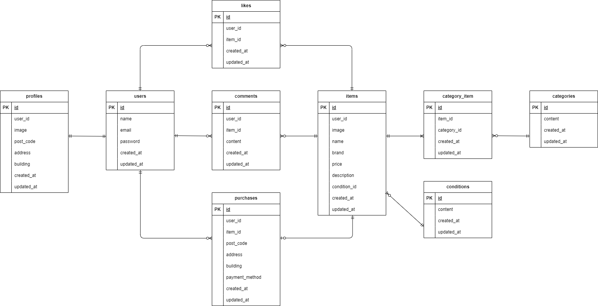

# フリマアプリ

## 環境構築
**Dockerビルド**
1. `git clone git@github.com:oura-takeshi/flea-market.git`
2. DockerDesktopアプリを立ち上げる
3. `docker-compose up -d --build`

> *MacのM1・M2チップのPCの場合、`no matching manifest for linux/arm64/v8 in the manifest list entries`のメッセージが表示されビルドができないことがあります。
エラーが発生する場合は、docker-compose.ymlファイルの「mysql」内に「platform」の項目を追加で記載してください*
``` bash
mysql:
    platform: linux/x86_64(この文追加)
    image: mysql:8.0.26
    environment:
```

**Laravel環境構築**
1. `docker-compose exec php bash`
2. `composer install`
3. 「.env.example」ファイルを 「.env」ファイルに命名を変更。または、新しく.envファイルを作成
4. .envに以下の環境変数を追加
``` text
DB_CONNECTION=mysql
DB_HOST=mysql
DB_PORT=3306
DB_DATABASE=laravel_db
DB_USERNAME=laravel_user
DB_PASSWORD=laravel_pass
```
5. アプリケーションキーの作成
``` bash
php artisan key:generate
```

6. シンボリックリンクの作成
``` bash
php artisan storage:link
```

7. マイグレーションの実行
``` bash
php artisan migrate
```

8. シーディングの実行
``` bash
php artisan db:seed
```

## userのログイン用初期データ

メールアドレス: hoge@example.com  
パスワード: hoge1234  
CO01～CO05の商品を出品

メールアドレス: fuga@example.com  
パスワード: fuga1234  
CO06～CO10の商品を出品

メールアドレス: piyo@example.com  
パスワード: piyo1234

## 使用技術(実行環境)
- PHP7.4.9
- Laravel8.83.8
- MySQL8.0.26

## テーブル仕様
### usersテーブル
| カラム名 | 型 | primary key | unique key | not null | foreign key |
| --- | --- | --- | --- | --- | --- |
| id | unsigned bigint | ◯ |  | ◯ |  |
| name | varchar(255) |  |  | ◯ |  |
| email | varchar(255) |  | ◯ | ◯ |  |
| password | varchar(255) |  |  | ◯ |  |
| created_at | timestamp |  |  |  |  |
| updated_at | timestamp |  |  |  |  |

### itemsテーブル
| カラム名 | 型 | primary key | unique key | not null | foreign key |
| --- | --- | --- | --- | --- | --- |
| id | unsigned bigint | ◯ |  | ◯ |  |
| user_id | unsigned bigint |  |  | ◯ | users(id) |
| image | varchar(255) |  |  | ◯ |  |
| name | varchar(255) |  |  | ◯ |  |
| brand | varchar(255) |  |  |  |  |
| price | int |  |  | ◯ |  |
| description | text |  |  | ◯ |  |
| condition_id | unsigned bigint |  |  | ◯ | conditions(id) |
| created_at | timestamp |  |  |  |  |
| updated_at | timestamp |  |  |  |  |

### profilesテーブル
| カラム名 | 型 | primary key | unique key | not null | foreign key |
| --- | --- | --- | --- | --- | --- |
| id | unsigned bigint | ◯ |  | ◯ |  |
| user_id | unsigned bigint |  |  | ◯ | users(id) |
| image | varchar(255) |  |  |  |  |
| post_code | varchar(255) |  |  | ◯ |  |
| address | varchar(255) |  |  | ◯ |  |
| building | varchar(255) |  |  |  |  |
| created_at | timestamp |  |  |  |  |
| updated_at | timestamp |  |  |  |  |

### purchasesテーブル
| カラム名 | 型 | primary key | unique key | not null | foreign key | 補足 |
| --- | --- | --- | --- | --- | --- | --- |
| id | unsigned bigint | ◯ |  | ◯ |  |  |
| user_id | unsigned bigint |  |  | ◯ | users(id) |  |
| item_id | unsigned bigint |  |  | ◯ | items(id) |  |
| post_code | varchar(255) |  |  | ◯ |  |  |
| address | varchar(255) |  |  | ◯ |  |  |
| building | varchar(255) |  |  |  |  |  |
| payment_method | tinyint |  |  | ◯ |  | 1:コンビニ払い 2:カード払い |  |
| created_at | timestamp |  |  |  |  |  |
| updated_at | timestamp |  |  |  |  |  |

### categoriesテーブル
| カラム名 | 型 | primary key | unique key | not null | foreign key |
| --- | --- | --- | --- | --- | --- |
| id | unsigned bigint | ◯ |  | ◯ |  |
| content | varchar(255) |  |  | ◯ |  |
| created_at | timestamp |  |  |  |  |
| updated_at | timestamp |  |  |  |  |

### conditionsテーブル
| カラム名 | 型 | primary key | unique key | not null | foreign key |
| --- | --- | --- | --- | --- | --- |
| id | unsigned bigint | ◯ |  | ◯ |  |
| content | varchar(255) |  |  | ◯ |  |
| created_at | timestamp |  |  |  |  |
| updated_at | timestamp |  |  |  |  |

### commentsテーブル
| カラム名 | 型 | primary key | unique key | not null | foreign key |
| --- | --- | --- | --- | --- | --- |
| id | unsigned bigint | ◯ |  | ◯ |  |
| user_id | unsigned bigint |  |  | ◯ | users(id) |
| item_id | unsigned bigint |  |  | ◯ | items(id) |
| content | varchar(255) |  |  | ◯ |  |
| created_at | timestamp |  |  |  |  |
| updated_at | timestamp |  |  |  |  |

### category_itemテーブル
| カラム名 | 型 | primary key | unique key | not null | foreign key |
| --- | --- | --- | --- | --- | --- |
| id | unsigned bigint | ◯ |  | ◯ |  |
| item_id | unsigned bigint |  |  | ◯ | items(id) |
| category_id | unsigned bigint |  |  | ◯ | categories(id) |
| created_at | timestamp |  |  |  |  |
| updated_at | timestamp |  |  |  |  |

### likesテーブル
| カラム名 | 型 | primary key | unique key | not null | foreign key |
| --- | --- | --- | --- | --- | --- |
| id | unsigned bigint | ◯ |  | ◯ |  |
| user_id | unsigned bigint |  |  | ◯ | users(id) |
| item_id | unsigned bigint |  |  | ◯ | items(id) |
| created_at | timestamp |  |  |  |  |
| updated_at | timestamp |  |  |  |  |

## ER図


## URL
- 開発環境：http://localhost/
- phpMyAdmin:：http://localhost:8080/

